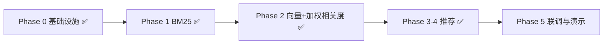

# 语义检索 & 智能推荐 — 功能实现计划

对应《技术选型.md》第 1/2 部分，分阶段实现并验收。

---

## 当前基线（已完成）

| 模块 | 状态 |
|------|------|
| ES Docker + IK 分词 + `campus_activities` 索引 | ✅ |
| MySQL → ES 索引构建（CRUD 同步 + 全量重建 API） | ✅ |
| GTE embedding ingest + `activity_embedding`（512 / cosine） | ✅ |
| Phase 1 BM25 关键词检索 | ✅ |
| Phase 2 dense kNN + 绝对阈值 + 加权相关度混合检索 | ✅ |
| 活动列表搜索 | ✅ keyword 非空且 ES 启用时走混合检索，否则 MySQL |
| 首页推荐 | ✅ 喜好向量 kNN + 硬过滤 + 社交/热度/时间加权（`recommend` 包）；ES 失败降级规则版 |

**当前进度（2026-07-14）**：Phase **0–4 已闭环**（检索 + 智能推荐可用）。  
**可选后续**：Phase 5（报名计数同步 ES、集成测试与答辩演示脚本）。

---

## 总体路线



推荐复用检索侧 `activity_embedding` / GTE；算法说明见 [`检索与推荐.md`](检索与推荐.md) §6。

---

## Phase 0：补齐基础设施（1–2 天）

**目标**：ES 环境稳定，索引数据完整，GTE 稠密向量模型可用。

### 实现

1. 启动全套 Docker：`mysql + redis + elasticsearch + kibana`
2. 执行 `.\init-es.ps1`（部署 GTE），确认模型 `state=started` / `fully_allocated`
3. 后端启动后管理员调用 `POST /api/v1/search/index/rebuild`
4. 确认 `campus_activities` 文档数 = MySQL 非 draft 活动数，且含 `activity_embedding`

### 验证

| 检查项 | 命令 / 方式 | 预期 |
|--------|-------------|------|
| ES 健康 | `GET /_cluster/health` | green/yellow |
| GTE 状态 | `GET _ml/trained_models/campus_gte/_stats` | `started` / `fully_allocated` |
| 文档数 | `GET campus_activities/_count` | ≥ seed 活动数 |
| IK 分词 | Kibana Dev Tools 执行 `kibana-analyze-demo.md` | 「大模型」能切出合理 token |
| 后端连通 | `GET /api/v1/search/index/stats`（admin token） | 返回 documentCount |

### Phase 0 检验记录

> 见本文档末尾「Phase 0 检验报告」章节（由脚本/人工验收后更新）。

---

## Phase 1：BM25 关键词检索（2–3 天）

**目标**：活动列表搜索从 MySQL 切换到 ES，先不做向量，降低复杂度。

### 实现

1. 新增 `ActivitySearchService`，封装 ES `multi_match` 查询（`title^3`, `description`, `tags`）
2. 新增 API：`GET /api/v1/search/activities?keyword=&category=&status=&page=&size=`
3. `ActivityService.list()` 在 `keyword` 非空且 ES 启用时走 ES，否则降级 MySQL
4. 前端 `ActivityList.jsx` 改调新接口（或原接口内部切换，对前端透明）
5. 过滤条件：`category`、`status`、`location` 用 ES `term` filter

### 验证

| 用例 | 输入 | 预期 Top 结果 |
|------|------|---------------|
| 精确词 | `羽毛球` | id=2 校园羽毛球友谊赛 |
| 同义词弱匹配 | `AI` | id=1 讲座、id=4 训练营 |
| 无结果 | `量子物理` | 空列表，不报错 |
| 降级 | 关闭 ES profile | 仍能用 MySQL LIKE 搜索 |
| 对比 | 同一 keyword，MySQL vs ES | 结果集大致一致或 ES 更准 |

**Kibana 验证**：

```json
GET campus_activities/_search
{
  "query": {
    "bool": {
      "must": [{ "multi_match": { "query": "大模型", "fields": ["title^3", "description"] }}],
      "filter": [{ "term": { "status": "published" }}]
    }
  }
}
```

---

## Phase 2：语义检索 — GTE kNN + 绝对阈值 + 加权相关度（3–5 天）

**目标**：实现技术选型中的完整语义检索链路（已落地，详见 `检索与推荐.md`）。

### 实现

**离线（索引增强）**

1. ingest pipeline `campus-activity-embedding`：GTE 对 `search_text`（title/description/category/tags/location，不含 college）写入 `activity_embedding`；活动创建/编辑同步 ES
2. `ActivityIndexService` 全量 / CRUD 同步挂 pipeline
3. 重建后确认文档含 512 维向量

**在线（检索融合）**

4. 并行两路召回：BM25 `multi_match` + GTE kNN（无 query: 前缀）
5. `SemanticScoreFilter`：仅语义命中需 `semanticScore >= 0.90`；BM25 豁免
6. `HybridRelevanceScorer`：加权相关度（不再用 RRF）
7. API：`mode=keyword|semantic|hybrid`（默认 `hybrid`）

### 验证

| 用例 | 查询 | 预期 |
|------|------|------|
| 语义命中 | `周末放松` | 召回桌游 / 心理 / 烘焙等（过阈值） |
| 关键词命中 | `羽毛球` | id=2 排前 |
| 混合优于单路 | 对比三种 mode | hybrid 兼顾精确与语义 |
| 性能 | 单次搜索 | P95 < 500ms（本地 ES） |

**演示建议**：准备 3 组 query，展示「BM25 搜不到、语义检索能搜到」的对比。

---

## Phase 3–4：智能推荐（已实现）

**目标**：替换规则版 `getRecommended()`，完成喜好向量 + 硬过滤 + 多因子加权（含社交与可用时间）。

### 实现要点

1. `UserPreferenceVectorService`：近 K 条报名 embedding 衰减加权平均 ⊕ 兴趣文本 GTE 凸组合；Redis 缓存  
2. ES `knnByVector` 召回 Top-N + `sim`  
3. 硬过滤：已报名、时间冲突  
4. `RecommendationScorer`：sim / tag / social / hot / time 归一化加权  
5. 社交：$s(A,B)=\log(1+c_{co})+0.8\log(1+c_{A\to B})+0.8\log(1+c_{B\to A})$（仅组织者）  
6. 冷启动 / ES 失败降级  

详见 [`检索与推荐.md`](检索与推荐.md) §6。单元测试：`VectorMathTest`、`RecommendationScorerTest`。

### 验证（手工）

| 用户 | 预期 |
|------|------|
| 兴趣不同的两用户 | 推荐列表有可感知差异 |
| 已报名 / 时间冲突活动 | 不出现在列表 |
| 无兴趣无报名 | 仍有热门结果 |

---

## Phase 5：联调、测试与演示（1–2 天）

### 实现

1. **增量同步补全**：`RegistrationService` / `FavoriteService` 更新时同步 ES 的 `signup_count`/`favorite_count`（推荐热度依赖）
2. 集成测试：`SearchIntegrationTest`、`RecommendationIntegrationTest`（Testcontainers ES 或 mock）
3. 更新 `scripts/e2e-api-test.ps1`：覆盖搜索 + 推荐流程
4. 准备演示脚本（5 分钟）：
   - Kibana 展示 IK 分词
   - 语义搜索「周末放松」
   - 两用户登录看不同推荐

### 验收清单（最终）

- [x] 语义检索：自然语言 query 能召回语义相关但无关键词匹配的活动（Phase 2）
- [x] 混合检索：加权相关度 Hybrid（Phase 2；τ=0.90）
- [x] 推荐：喜好向量 + 多因子排序（Phase 3–4）
- [x] 社交：与组织者共现强度进入加权（Phase 3–4）
- [x] 时间：已报名冲突硬过滤；可用时间为软分（Phase 3–4）
- [x] 稳定：ES 不可用时推荐可降级规则版
- [ ] Phase 5：signup/favorite 增量同步 ES、答辩演示脚本（可选）

---

## 建议优先级与时间估算

| 阶段 | 优先级 | 预估 | 交付物 | 状态 |
|------|--------|------|--------|------|
| Phase 0 | P0 | 1–2 天 | GTE + 索引有数据 | ✅ |
| Phase 1 | P0 | 2–3 天 | BM25 搜索可用 | ✅ |
| Phase 2 | P0 | 3–5 天 | **语义检索完整闭环** | ✅ |
| Phase 3–4 | P1 | 2–3 天 | **推荐完整闭环** | ✅ |
| Phase 5 | P2 | 1–2 天 | 测试 + 答辩材料 | ⬜ 可选 |

**已完成**：Phase 0–4（语义检索 + 智能推荐可用）。

---

## 风险与应对

| 风险 | 应对 |
|------|------|
| GTE 内存不足 / Eland 导入慢 | 开发阶段 `-SkipEmbedding`；Docker ≥2GB；需访问 Hugging Face |
| 活动太少，语义效果不明显 | 补充 seed 数据（10–20 条多样化活动） |
| ES 查询复杂度高 | Phase 1 先 BM25，Phase 2 再加向量；不要一步到位 |
| 推荐效果难量化 | 准备 2–3 个固定用户 persona + 预期 Top-3，写进测试用例 |

---

## Phase 0 检验报告

| 检查项 | 结果 | 备注 |
|--------|------|------|
| Docker 服务 | PASS (全部容器运行中) | campus-mysql/redis/elasticsearch/kibana |
| ES 集群健康 | PASS (status=green) | |
| 嵌入模型 | PASS（后续升级为 GTE `campus_gte`） | 初检为 ELSER；2026-07-14 起以 GTE 为准 |
| 索引 campus_activities | PASS (索引已存在) | |
| IK 分词 | PASS (分词正常) | |
| MySQL 活动数 vs ES 文档数 | 初检 ES=6；现 seed=18 | 以 rebuild 后一致为准 |
| 后端 index/stats API | SKIP (后端未启动（非阻塞）) | |

**检验时间**：2026-07-13 15:30:11（初检）  
**结论**：导出基础设施通过；向量模型以当前 GTE 方案为准（见 Phase 1&2 报告）。

---

## Phase 1 & 2 检验报告（语义检索）

### 后端分层

```
controller/   ActivitySearchController, SearchIndexController
service/      ActivitySearchService（编排、阈值筛除、加权相关度、MySQL 回填）
repository/   ActivitySearchRepository → ElasticsearchActivitySearchRepository
support/      HybridRelevanceScorer, SemanticScoreFilter, ActivitySearchRanker
config/       ElasticsearchClientConfig, ElasticsearchSearchInfrastructure
              ActivityIndexService, ActivityDocumentMapper
```

### 检索策略

| 模式 | 实现 | API |
|------|------|-----|
| keyword | ES `multi_match`（title^3, description^2, search_text, tags）+ IK | `mode=keyword` |
| semantic | GTE dense kNN on `activity_embedding`（cosine；无 E5 前缀）+ τ 过滤 | `mode=semantic` |
| hybrid | 两路召回 + 绝对阈值(0.90) + `HybridRelevanceScorer` 加权分 | `mode=hybrid`（默认） |

活动列表 `GET /api/v1/activities?keyword=` 在 ES 启用时默认 **hybrid**；专用接口 `GET /api/v1/search/activities`。

### 验证结果（2026-07-13）

| 用例 | 模式 | 结果 |
|------|------|------|
| `羽毛球` | keyword | ✅ 命中 id=2 羽毛球赛 |
| `大模型` | keyword | ✅ 命中 AI 讲座 |
| `周末放松` | keyword | ✅ 0 条（无字面匹配） |
| `周末放松` | semantic | ✅ 召回摄影采风、羽毛球、音乐节等 |
| `周末放松` | hybrid | ✅ 语义相关活动排前 |
| 索引 rebuild | POST `/api/v1/search/index/rebuild` | ✅ 现为 18 条 seed + `activity_embedding` |
| 单元测试 | `HybridRelevanceScorerTest` 等 | ✅ 通过 |

### 启动方式

```powershell
cd database; docker compose up -d
.\init-es.ps1                    # 首次或 -ForceRecreateIndex 重建 mapping
cd ..\backend
.\mvnw.cmd spring-boot:run       # ES 默认开启；无 ES 时设 ES_ENABLED=false
# admin001 登录后 POST /api/v1/search/index/rebuild
```

**注意**：Java 客户端须与 ES 8.15 对齐（`pom.xml` 锁定 `elasticsearch-java` / `rest-client` 8.15.5），勿使用 Spring Boot 默认的 9.x 客户端。

**结论**：Phase 1 & 2 通过

---

## 检索增强（语义筛除 + 加权相关度 + 综合排序）

### 语义筛除 + 加权相关度

- 语义路为 **GTE dense kNN（cosine）**；`semanticScore` ≈ `(1 + cosine) / 2`，约在 `[0, 1]`
- 对 **仅语义召回** 的文档应用**绝对阈值**：`semanticScore >= 0.90`（`app.elasticsearch.semantic-absolute-threshold`）
- **BM25 命中的文档始终保留**（豁免阈值）
- Hybrid 用 `HybridRelevanceScorer`：`relevance = λ_bm25 * bm25_norm + λ_sem * s_sem + λ_bonus`（有关键词）；纯语义为 `λ_sem_only * s_sem`
- `ActivitySearchHit`：`keywordScore` / `semanticScore` / `fusedScore`（= relevance）

### 排序（后端）

| sort | 说明 |
|------|------|
| relevance | 按加权相关度（默认，有关键词时） |
| hot | signupCount + favoriteCount |
| time / signup | 开始时间 / 报名人数 |
| composite | `w * norm(相关度) + (1-w) * norm(热度)`，默认 w=0.7 |

API：`GET /api/v1/activities?keyword=&sort=&matchWeight=` 或 `/api/v1/search/activities`

前端：有关键词时不再客户端重排；选「综合匹配」时 Slider 调节 w。

### 算法验证（2026-07-13）

#### 验证方法

| 层级 | 内容 | 命令 / 脚本 |
|------|------|-------------|
| 单元测试 | `SemanticScoreFilter` / `HybridRelevanceScorer` / `ActivitySearchRanker` | `cd backend && .\mvnw.cmd test -Dtest=SemanticScoreFilterTest,HybridRelevanceScorerTest,ActivitySearchRankerTest` |
| 集成 API | `/api/v1/search/activities`，对比 `mode` / `sort` / `matchWeight` | `python scripts/verify-search-algorithms.py` |
| 前置条件 | ES + 索引（建议 18 条 seed）；后端默认启用 ES | 见 [`检索与推荐.md`](检索与推荐.md) §5.4 |

#### 语义绝对阈值 + 加权相关度（2026-07-14）

| 项 | 配置 / 结论 |
|----|-------------|
| 模型 / 字段 | `campus_gte` → `activity_embedding` |
| 阈值 | `semanticScore >= 0.90`；BM25 豁免 |
| 相关度 | `HybridRelevanceScorer`（λ_bm25=0.50, λ_sem=0.35, bonus=0.15, sem_only=0.90） |
| 实验 | 见 `report/cosine-threshold-experiment.md`（18 条活动） |

**结论**：τ=0.90 可砍掉约 0.85–0.89 的弱语义长尾；关键词命中靠豁免 + 加权分仍排前。

#### 综合匹配 / 后端排序

**周末放松**（hybrid 召回 5 条，id 4 已筛除）：

| sort | 参数 | ID 顺序 | 与预期 |
|------|------|---------|--------|
| relevance | — | 6 → 1 → 5 → 3 → 2 | 按加权相关度 |
| hot | — | 6 → 1 → **2 → 3 → 5** | 按热度 610→127→71→57→50，与 relevance 不同 ✓ |
| composite | w=1.0 | 同 relevance | 纯相关度 ✓ |
| composite | w=0.0 | **同 hot** | 纯热度 ✓ |
| composite | w=0.7 | 同 relevance | 相关度权重高，顺序与 hot 未拉开 |

**羽毛球**（BM25 精确命中 id=2）：

| sort | matchWeight | ID 首位 | 说明 |
|------|-------------|---------|------|
| relevance | — | **2**（羽毛球赛） | 加权相关度下关键词命中排第一 ✓ |
| composite | 1.0 | **2** | w=1 等同相关度 ✓ |
| composite | 0.0 | **6**（音乐节，hot=610） | w=0 等同热度 ✓ |
| composite | 0.5 | **6 → 2** | 相关度与热度折中，精确命中仍第二 ✓ |

#### 单元测试

上述 3 个测试类 **全部通过**（与全量 `mvn test` 46 项一致）。

**结论**：检索增强（语义筛除 + 后端排序 + 综合匹配）**验证通过**；小语料下阈值筛除与 composite 差异需更多 seed 或调参后更易感知。

