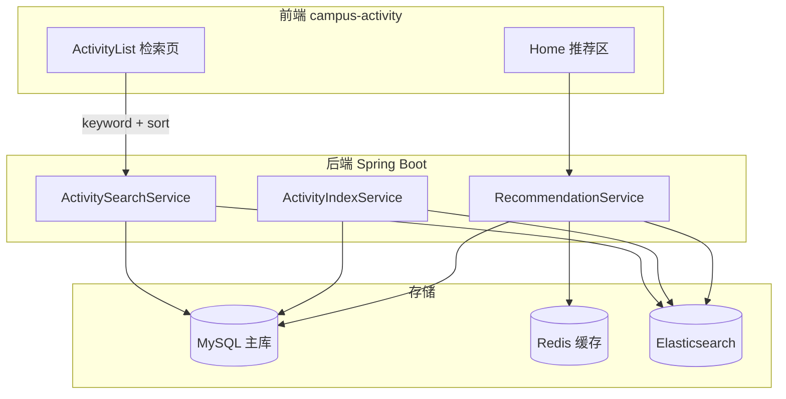
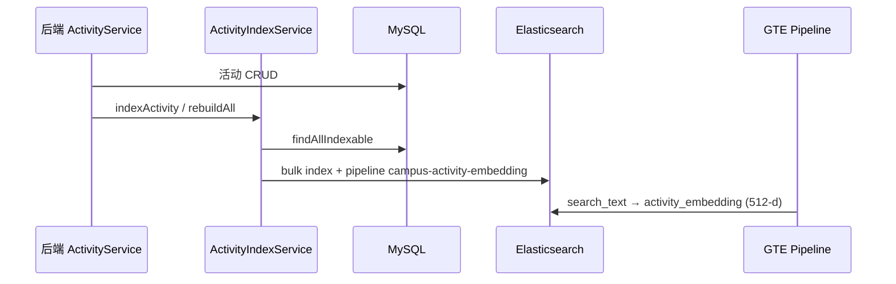
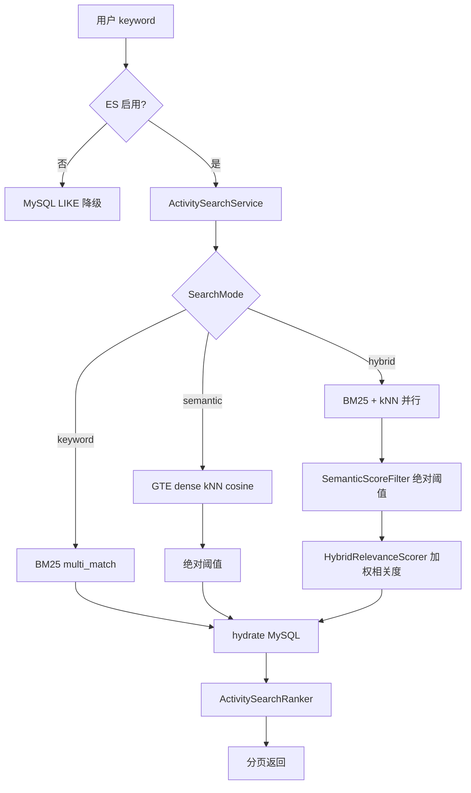
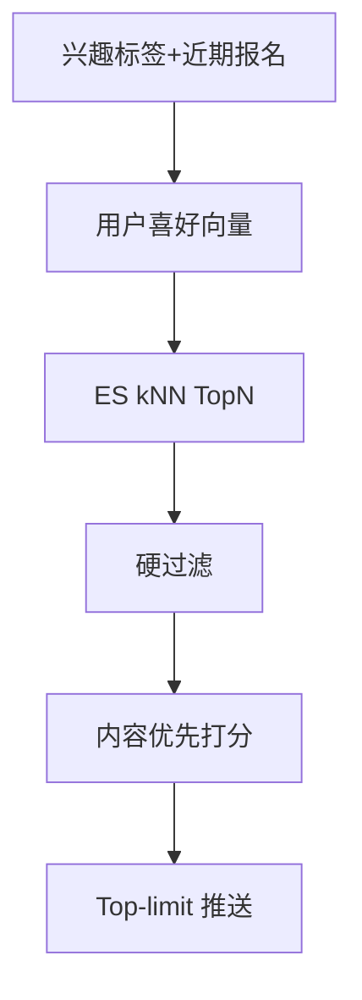

# 检索与推荐模块说明

本文档描述校园活动平台中 **语义检索** 与 **智能推荐** 两个功能的统一设计与实现。二者共享 Elasticsearch 8.x 集群、**GTE 稠密向量模型**（`campus_gte`）与活动索引 `campus_activities`；检索在 `search` 包，推荐在 `recommend` 包（见 [§6](#6-智能推荐已落地)）。

---

## 1. 模块定位

| 能力 | 用户场景 | 核心问题 |
|------|----------|----------|
| **语义检索** | 活动列表页输入自然语言或关键词 | 从海量活动中找出**与 query 相关**的结果 |
| **智能推荐** | 首页「为你推荐」 | 根据兴趣、行为、社交、时间等找出**用户可能想参加**的活动 |



**设计原则**

- **MySQL**：唯一数据源（Source of Truth），存活动、用户、报名等全量业务数据。
- **Elasticsearch**：语义检索与推荐召回共用派生索引 / 向量。
- **Redis**：活动详情 / 热门列表缓存；推荐缓存用户喜好向量。

---

## 2. 工程结构

**数据路径（避免混淆）**

| 场景 | 读哪里 |
|------|--------|
| 活动列表（无 keyword） | **MySQL** |
| 活动列表（有 keyword） | **ES** Hybrid → 用 ID 回填 MySQL；若 ES 索引文档数为 0 则降级 MySQL LIKE |
| 首页推荐 | **ES** 喜好向量 kNN → 硬过滤 → 加权；失败则规则降级 |
| 索引写入 | MySQL → `ActivityIndexService` + pipeline → ES `activity_embedding` |

### 2.1 目录总览

```
Group16-A3/
├── doc/                               # 设计 / 说明文档
│   ├── 检索与推荐.md
│   ├── 技术选型.md
│   └── 功能实现计划.md
├── report/                            # 实验与测试报告
│   ├── cosine-threshold-experiment.md
│   ├── recommend-score-experiment.md
│   └── embedding-mds-visualize.md     # 向量 MDS 可视化
├── database/                          # 基础设施
│   ├── docker-compose.yml             # MySQL / Redis / ES / Kibana
│   ├── init-es.ps1                    # 建索引、部署 GTE、embedding ingest pipeline
│   └── elasticsearch/
│       ├── activity-index.json        # campus_activities mapping
│       └── kibana-analyze-demo.md     # IK 分词演示
│
├── backend/src/main/java/com/example/demo/
│   ├── config/
│   │   ├── ElasticsearchClientConfig.java    # ES 8.15 Java Client
│   │   └── ElasticsearchProperties.java        # 检索/推荐相关配置
│   ├── controller/
│   │   ├── ActivityController.java             # /activities（含 keyword 检索）
│   │   ├── ActivitySearchController.java       # /search/activities
│   │   └── SearchIndexController.java          # /search/index/rebuild|stats
│   ├── service/
│   │   └── ActivityService.java                # 列表降级；委托 RecommendationService
│   ├── search/                                 # ★ 检索子模块
│   │   ├── ActivityDocumentMapper.java / ActivityIndexService.java …
│   │   ├── service/ActivitySearchService.java
│   │   └── support/{HybridRelevanceScorer,SemanticScoreFilter,ActivitySearchRanker,…}
│   └── recommend/                              # ★ 推荐子模块
│       ├── RecommendationService.java          # 编排：向量→kNN→过滤→加权
│       ├── UserPreferenceVectorService.java    # 喜好向量 + Redis
│       ├── SocialAffinityService.java
│       ├── RecommendationScorer.java
│       ├── repository/ElasticsearchRecommendationRepository.java
│       └── support/{VectorMath,ActivityTimeSlot}.java
│
├── backend/scripts/
│   ├── cosine-threshold-experiment.py
│   ├── recommend-score-experiment.py
│   └── embedding-mds-visualize.py     # Metric MDS 可视化
│
└── campus-activity/src/
    ├── pages/ActivityList.jsx / Home.jsx
    └── services/activityApi.js
```

### 2.2 后端分层职责

| 层 | 类 | 职责 |
|----|-----|------|
| Controller | `ActivitySearchController` | 专用搜索 API，显式指定 `mode` |
| Controller | `ActivityController` | 活动列表；有 `keyword` 时委托 `ActivitySearchService` |
| Controller | `SearchIndexController` | 管理员全量重建 / 索引统计 |
| Service | `ActivitySearchService` | 模式选择、语义筛除、加权相关度、MySQL 回填、排序、分页 |
| Repository | `ElasticsearchActivitySearchRepository` | 构造 ES 查询（BM25 / dense kNN） |
| Service | `ActivityIndexService` | CRUD 同步 + bulk rebuild（挂 embedding pipeline） |
| Support | `HybridRelevanceScorer` / `SemanticScoreFilter` / `ActivitySearchRanker` | 纯算法，无 IO |

---

## 3. 索引与数据流

### 3.1 索引 Mapping（`campus_activities`）

| 字段 | 类型 | 用途 |
|------|------|------|
| `title`, `description`, `search_text` | text + IK | BM25 关键词检索 |
| `tags`, `category`, `location`, `status` | keyword | 过滤 / 精确匹配 |
| `activity_embedding` | dense_vector 512 / cosine | GTE 写入的稠密向量（kNN） |
| `signup_count`, `favorite_count` | integer | 热度排序 / 未来推荐打分 |
| `start_time`, `end_time` | date | 时间过滤（规划中） |

`search_text` 由活动内容字段拼接（`ActivityDocumentMapper`）：
`title` + `description` + `category`（含中文类别名）+ `tags` + `location`。
**不含** `college`（避免「计算机学院」类归属信息导致「计算机科学」误召回篮球等）、活动记录、评价、报名/收藏计数。
`college` 仍作为独立 keyword 字段可过滤。创建/编辑活动时除写 MySQL 外，经 ingest pipeline 重算向量。

### 3.2 离线：索引构建



**触发方式**

1. **增量**：活动创建/更新/删除时，`ActivityService` 调用 `ActivityIndexService`（`@ConditionalOnProperty` ES 启用时生效）。
2. **全量**：管理员 `POST /api/v1/search/index/rebuild`。
3. **初始化**：`database/init-es.ps1` 创建索引、部署 `campus_gte`、注册 embedding ingest pipeline。

### 3.3 在线：语义检索流程



**降级策略**

- ES 未启用（`ES_ENABLED=false`）：`GET /activities?keyword=` 走 MySQL `LIKE`。
- 语义通路异常：Hybrid 降级为纯 BM25；Semantic 模式降级为 BM25。

---

## 4. 检索算法

### 4.1 BM25 关键词检索（Phase 1）

**原理**：基于词频 TF、逆文档频率 IDF 与文档长度归一化的经典排序；ES `multi_match` 默认使用 BM25。

**实现**（`ElasticsearchActivitySearchRepository.buildKeywordQuery`）：

```
fields: title^3, description^2, search_text, tags
analyzer: IK 分词（索引 ik_max，检索 ik_smart）
filter: category / status / location；排除 draft
```

**特点**：精确字面匹配；「羽毛球」能命中标题含该词的活动；「周末放松」若无字面匹配则 0 条。

### 4.2 GTE 稠密向量语义检索（Phase 2）

**原理**：`campus_gte`（Hugging Face `thenlper/gte-small-zh`）将中文文本编为 **512 维稠密向量**，用 **cosine** 相似度做 kNN。

**离线**：ingest pipeline `campus-activity-embedding` 对 `search_text` 做 GTE 推理，写入 `activity_embedding`（**无** E5 式 `passage:` 前缀）。

**在线**：kNN + `query_vector_builder.text_embedding`，`model_text` 为原始 keyword（**无** `query:` 前缀）：

```
knn on activity_embedding
model_id = campus_gte   # thenlper/gte-small-zh via Eland
model_text = keyword
```

**分数**：ES cosine 下 `_score` 一般为 `(1 + cosine) / 2`，落在约 `[0, 1]`，即 API 的 `semanticScore`。还原：`approx_cosine ≈ 2 * semanticScore - 1`。

**特点**：「周末放松」可召回无共同关键词但语义相近的活动。

#### 相对 `.multilingual-e5-small`（中文 C-MTEB 对照）

同属轻量级 embedding；`gte-small-zh` 为**中文专用**，在公开中文基准 **C-MTEB** 上整体与检索子任务高于多语 E5-small（数字来自模型卡 / FlagEmbedding C-MTEB 汇总表，评测协议一致时方可对比）：

| 模型 | 维数 | 体积约 | C-MTEB Avg | Retrieval | STS | Classification |
|------|------|--------|------------|-----------|-----|----------------|
| `intfloat/multilingual-e5-small` | 384 | ~0.12 GB | **55.38** | **59.95** | 45.27 | 65.85 |
| `thenlper/gte-small-zh` | 512 | ~0.10 GB | **60.04** | **65.50** | 49.72 | 64.35 |

解读：

- **检索（Retrieval）**：约 59.95 → 65.50，相对提升约 **+5.5 分**，与校园活动「按意图召回」最相关。
- **综合 Avg**：约 +4.7 分；体量同属 small，本地 2GB 级 ES 更友好。
- 代价/注意：中文专用，**非中文 query 会明显变弱**；换模后余弦分数分布变化，**必须重测绝对阈值 τ**。

参考：[thenlper/gte-small-zh](https://huggingface.co/thenlper/gte-small-zh)、[FlagEmbedding C_MTEB](https://github.com/FlagOpen/FlagEmbedding/blob/master/C_MTEB/README.md) / BGE 文档中的 multilingual-e5-small 行。

### 4.3 语义绝对阈值筛除

**问题**：稠密向量分数整体偏高，弱相关向量命中不应进入最终结果。

**策略**（`SemanticScoreFilter`，默认 `τ = 0.90`，约合 cosine ≥ 0.80）：

- **BM25 已命中**的活动：始终保留（豁免阈值）。
- **仅语义召回**的活动：要求 `semanticScore >= τ`。

配置：`app.elasticsearch.semantic-absolute-threshold=0.90`（GTE 实验固定，见 `report/cosine-threshold-experiment.md`）。

### 4.4 加权相关度融合（Hybrid）

**问题**：BM25 与语义分量纲不同；纯排名融合（RRF）不利于解释「关键词优先 + 语义补召」。

**策略**（`HybridRelevanceScorer`）：对筛除后的候选集合分：

```
s_bm25_norm = bm25(d) / max_bm25(本轮召回)     # 无 BM25 命中则为 0
s_sem       = semanticScore(d) 或 0            # 已是约 [0,1]

若有 BM25 命中:
  relevance = λ_bm25 * s_bm25_norm + λ_sem * s_sem + λ_bonus
否则（仅语义，且已过阈值）:
  relevance = λ_sem_only * s_sem
```

默认权重：

| 参数 | 配置项 | 默认 |
|------|--------|------|
| λ_bm25 | `app.elasticsearch.relevance-bm25-weight` | 0.50 |
| λ_sem | `app.elasticsearch.relevance-semantic-weight` | 0.35 |
| λ_bonus | `app.elasticsearch.relevance-keyword-bonus` | 0.15 |
| λ_sem_only | `app.elasticsearch.relevance-semantic-only-weight` | 0.90 |

**效果**：关键词命中档整体高于纯语义档；同档内由 BM25 与语义微调顺序。`searchScore` / `fusedScore` = `relevance`。

> `ReciprocalRankFusion` 仍保留在代码库中，但 hybrid 路径已不再调用。

### 4.5 后端排序

有关键词时由 `ActivitySearchRanker` 统一排序（前端不再重排）：

| sort | 行为 |
|------|------|
| `relevance` | 按 `searchScore`（加权相关度）降序（默认） |
| `hot` | 按 `signupCount + favoriteCount` 降序 |
| `time` | 按 `startTime` 升序 |
| `signup` | 按 `signupCount` 降序 |
| `composite` | `w * norm(相关度) + (1-w) * norm(热度)` |

- 归一化：在当前召回列表内 min-max；若 max=min 则 norm=1。
- 默认 `w=0.7`；前端「综合匹配」Slider 调节 `matchWeight`（0–1）。

---

## 5. API 与配置

### 5.1 检索 API

| 方法 | 路径 | 说明 |
|------|------|------|
| GET | `/api/v1/activities?keyword=&sort=&matchWeight=` | 列表；有 keyword 且 ES 启用时走 Hybrid 检索 |
| GET | `/api/v1/search/activities?keyword=&mode=&sort=&matchWeight=` | 专用搜索；`mode=keyword\|semantic\|hybrid` |
| POST | `/api/v1/search/index/rebuild` | 管理员全量重建索引 |
| GET | `/api/v1/search/index/stats` | 管理员索引文档数 |

**响应字段（检索相关）**

| 字段 | 含义 |
|------|------|
| `searchScore` | 加权相关度 / 主通路分（hybrid 下为 `relevance`） |
| `keywordScore` | BM25 原始分（未命中为 null） |
| `semanticScore` | GTE kNN cosine 映射分（约 [0,1]，未命中为 null） |
| `compositeScore` | 综合匹配排序分（仅 sort=composite 时有值） |
| `searchChannel` | keyword / semantic / hybrid |

### 5.2 推荐 API

| 方法 | 路径 | 说明 |
|------|------|------|
| GET | `/api/v1/activities/recommended?limit=6` | 智能推荐（喜好向量 kNN + 硬过滤 + 加权；ES 失败降级规则版） |

### 5.3 配置项

| 配置 | 默认 | 说明 |
|------|------|------|
| `app.elasticsearch.enabled` | true | 默认开启；无 ES 时设 `ES_ENABLED=false` |
| `spring.elasticsearch.uris` | localhost:9200 | ES 地址 |
| `app.elasticsearch.embedding-model-id` | `campus_gte` | GTE-small-zh（512 维） |
| `app.elasticsearch.search-recall-size` | 50 | 每路召回 Top-N |
| `app.elasticsearch.semantic-absolute-threshold` | 0.90 | 语义绝对阈值（ES 分，约 cosine≥0.80）；仅语义命中生效 |
| `app.elasticsearch.relevance-bm25-weight` | 0.50 | hybrid：BM25 归一化分权重 |
| `app.elasticsearch.relevance-semantic-weight` | 0.35 | hybrid：有关键词时的语义权重 |
| `app.elasticsearch.relevance-keyword-bonus` | 0.15 | hybrid：BM25 命中额外加分 |
| `app.elasticsearch.relevance-semantic-only-weight` | 0.90 | hybrid：纯语义候选缩放系数 |
| `app.elasticsearch.rrf-rank-constant` | 60 | 遗留；hybrid 已改加权分，一般无需改 |

### 5.4 启动与验证

```powershell
# 1. 基础设施
cd database
docker compose up -d
.\init-es.ps1

# 2. 后端（ES 默认开启；未起 ES 时用 $env:ES_ENABLED="false"）
cd ..\backend
.\mvnw.cmd spring-boot:run

# 3. 全量索引（admin001 / 123456）——写入 activity_embedding
POST /api/v1/search/index/rebuild

# 4. 算法回归（需先登录拿 JWT，或运行脚本）
python scripts/verify-search-algorithms.py
# 输出 report/search-verify-results.json
```

**快速验证**

| 查询 | mode | 预期 |
|------|------|------|
| 羽毛球 | keyword | 1 条左右 |
| 周末放松 | keyword | 0 条 |
| 周末放松 | semantic / hybrid | 语义相关结果；仅语义命中需 `semanticScore >= 0.90`；关键词命中豁免 |
| 羽毛球 | hybrid + sort=relevance | 羽毛球赛（id=2）排第一 |
| 周末放松 | hybrid + sort=hot | 顺序按热度，与 relevance **不同** |
| 羽毛球 | hybrid + sort=composite + matchWeight=0 | 音乐节（id=6）排第一 |

---

## 6. 智能推荐（已落地）

> **状态**：`RecommendationService` 已接入 `GET /api/v1/activities/recommended`；ES 不可用时降级为规则推荐。

### 6.1 流水线



API：`GET /api/v1/activities/recommended?limit=`；`recommendScore = round(clamp01(final/(1+ε)) × 100)`；
每条附带 `recommendReasons`（最多 3 个中文标签：兴趣匹配 / 内容相似 / 社交相关 / 热门活动 / 时间合适）。

### 6.2 用户喜好向量

包：`UserPreferenceVectorService`；缓存 Redis `campus:user:pref_vector:{userId}`（TTL 6h；改兴趣 / 报名成功 / 审核时失效）。

1. **历史侧**：最近 $K=10$ 条报名（`status ≠ rejected`），从 ES `mget` 取各活动 `activity_embedding`。  
   衰减权重：$w_i = 0.5^{d_i/30}$（$d_i$ 为距报名天数，半衰期 30 天）。  
   $v_{hist} = \mathrm{normalize}(\sum_i w_i v_i)$（缺向量则跳过）。
2. **兴趣侧**：`interests` 空格拼接 → GTE `_infer` → $v_{int}$。
3. **凸组合**：两侧都有时 $v_u=\mathrm{normalize}(0.4\,v_{int}+0.6\,v_{hist})$；仅一侧则用该侧；都无则**冷启动**（不做 kNN）。

### 6.3 召回与硬过滤

- **召回**：ES kNN，`query_vector=v_u`，`status=published`，默认 $N=50$，得分 `sim`（约 $(1+\cos)/2$）。
- **硬过滤**：去掉已报名活动；去掉与任一已报名活动时间区间重叠的候选（`start < otherEnd ∧ end > otherStart`）。
- **补召回**：过滤后候选数 $<12$ 时，将 kNN 扩到 $100$；仍不足则用兴趣标签命中的已发布活动回填（`sim` 取当前池最小分 $-0.02$ 作为先验）。

### 6.4 最终推荐分（内容优先）

针对「窄 sim 分布 + 全零 tag 被 min-max 刷成满分」问题（见 `report/recommend-score-experiment.md`），打分改为：

$$
\mathrm{final}=\mathrm{sim}_{\mathrm{comp}}+\varepsilon\cdot\mathrm{aux},\quad \varepsilon=0.25
$$

$$
\mathrm{aux}=\frac{0.15\cdot\mathrm{tag}_{n}+0.05\cdot\mathrm{soc}_{n}+0.10\cdot\mathrm{hot}_{n}+0.05\cdot\mathrm{time}}{0.15+0.05+0.10+0.05}
$$

| 因子 | 含义与归一 |
|------|------|
| $\mathrm{sim}_{\mathrm{comp}}$ | 候选 sim 跨度 $\le\delta=0.03$ 时用**绝对** ES `_score`；跨度更大时才做候选内 min-max |
| $\mathrm{tag}_{n}$ | $\min(1,\ \mathrm{hits}/\mathrm{tagCap})$，`tagCap=2`；**不**对全零做 min-max |
| $\mathrm{soc}_{n}$ | $\min(1,\ s/s_0)$，$s_0=3.5$；社交权重降至 **0.05** |
| $\mathrm{hot}_{n}$ | $\log(1+\mathrm{signup}+\mathrm{favorite})$ 后候选内 min-max；`max=min` 时输出 **0**（非 1） |
| $\mathrm{time}$ | 是否落在 `available_time`（0/1；未设置则 1） |

展示分：`recommendScore = round(clamp01(final / (1+ε)) × 100)`。

**社交强度**（用户 $A$，组织者 $B$）：

- $c_{co}$：共同报名活动数  
- $c_{A\to B}$：$A$ 报名且组织者为 $B$ 的次数  
- $c_{B\to A}$：$B$ 报名且组织者为 $A$ 的次数  

$s(A,B)=\log(1+c_{co})+0.8\log(1+c_{A\to B})+0.8\log(1+c_{B\to A})$

在线对候选组织者由 MySQL 聚合（语料小，无需全量共现表）。

**冷启动**：无 $v_u$ 时从热门 Top-$N$ 取候选 → 硬过滤 → $\mathrm{final}=\mathrm{aux}$（原 sim 权重并入 hot）。  
**降级**：ES 关闭 / 向量或 kNN 失败 → `getRecommendedLegacy`（标签×30 + 热度）。

### 6.5 代码位置

```
backend/.../recommend/
├── RecommendationService.java
├── UserPreferenceVectorService.java
├── SocialAffinityService.java
├── RecommendationScorer.java
├── RecommendationHit.java
├── repository/ElasticsearchRecommendationRepository.java
└── support/{VectorMath,ActivityTimeSlot}.java
```

配置前缀：`app.elasticsearch.pref-*` / `recommend-weight-*`（见 `application.properties`）。

---

## 7. 三库协作小结

| 存储 | 检索模块 | 推荐模块 |
|------|----------|----------|
| **MySQL** | 活动主数据；ID 回填 | 报名/冲突过滤、社交聚合、冷启动热门、详情回填 |
| **Elasticsearch** | BM25 + GTE kNN + τ + 加权相关度 | 活动 embedding mget / 兴趣 infer / 喜好向量 kNN |
| **Redis** | 热门列表、详情缓存 | 用户喜好向量缓存 |

---

## 8. 演进路线

| 阶段 | 检索 | 推荐 | 状态 |
|------|------|------|------|
| Phase 0 | ES + IK + GTE 基础设施 | — | ✅ |
| Phase 1 | BM25 关键词检索 | — | ✅ |
| Phase 2 | GTE dense kNN + 绝对阈值(0.90) + 加权相关度 Hybrid；后端排序 | — | ✅ |
| Phase 3–4 | — | 喜好向量 kNN + 硬过滤 + 社交/热度/时间加权 | ✅ |
| Phase 5 | 集成测试、压测、演示脚本 | 增量同步 signup/favorite 到 ES（可选增强） | 部分待做 |

**后续可优化**

- 按业务微调 `semantic-absolute-threshold` 与相关度权重（见余弦实验表）。
- 独立 `hot_score` 字段与定时更新任务，统一检索/推荐的热度计算。
- 检索结果卡片展示 `searchScore`，便于答辩演示。

---

## 9. 算法验证报告

### 9.1 验证范围

| 算法 | 实现类 | 验证方式 |
|------|--------|----------|
| 语义绝对阈值筛除 | `SemanticScoreFilter` | 单元测试；默认 τ=0.90 |
| 加权相关度融合 | `HybridRelevanceScorer` | 单元测试（关键词档优先、BM25 比序） |
| 后端排序 | `ActivitySearchRanker` | 单元测试 + API 对比 sort / matchWeight |
| 综合匹配 | `ActivitySearchRanker.applyCompositeSort` | API：`matchWeight` 0 / 0.5 / 1.0 |

### 9.2 单元测试

```powershell
cd backend
.\mvnw.cmd test -Dtest=SemanticScoreFilterTest,HybridRelevanceScorerTest,ActivitySearchRankerTest
```

| 测试类 | 覆盖点 |
|--------|--------|
| `SemanticScoreFilterTest` | BM25 命中豁免；仅语义需 ≥ τ（含 0.90 用例） |
| `HybridRelevanceScorerTest` | 关键词档优先；同档 BM25 更高者排前；纯语义缩放 |
| `ActivitySearchRankerTest` | `hot` / `composite` 排序 |

### 9.3 余弦阈值实验（2026-07-14）

环境：18 条 seed；GTE；详见 `report/cosine-threshold-experiment.md`。

- gte-small-zh（`search_text`=title/description/category/tags/location，不含 college）：完全匹配 Top1 约 0.94–0.96；主题 Top1 约 0.92–0.93；**τ=0.90** 已固定。详见最新 `report/cosine-threshold-experiment.md`。

### 9.4 结论与局限

| 项 | 结论 |
|----|------|
| GTE dense kNN | **生效**；512 维 `activity_embedding`；`semanticScore` ≈ `(1+cos)/2` |
| 绝对阈值 | 默认 **τ=0.90**（18 条实验）；BM25 命中豁免 |
| 加权相关度 | **替代 RRF**；关键词档优先，纯语义档缩放；`sort=relevance` 按此排序 |
| 实验表 | `report/cosine-threshold-experiment.md` |

---

## 10. 参考文档

- [`技术选型.md`](技术选型.md) — 原始方案与多因子推荐公式
- [`功能实现计划.md`](功能实现计划.md) — 分阶段验收与检验报告
- [`../report/embedding-mds-visualize.md`](../report/embedding-mds-visualize.md) — 活动/用户向量 MDS 二维可视化
- [`database/README.md`](database/README.md) — Docker 与 ES 初始化
- [`database/elasticsearch/kibana-analyze-demo.md`](database/elasticsearch/kibana-analyze-demo.md) — IK 分词 Dev Tools 示例
