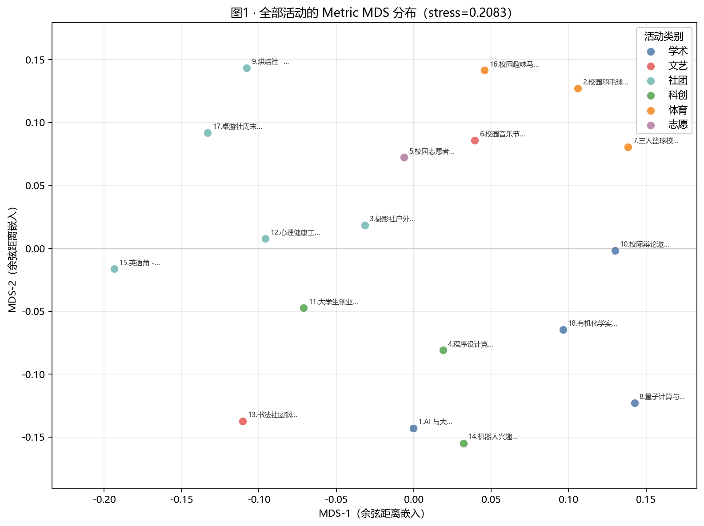
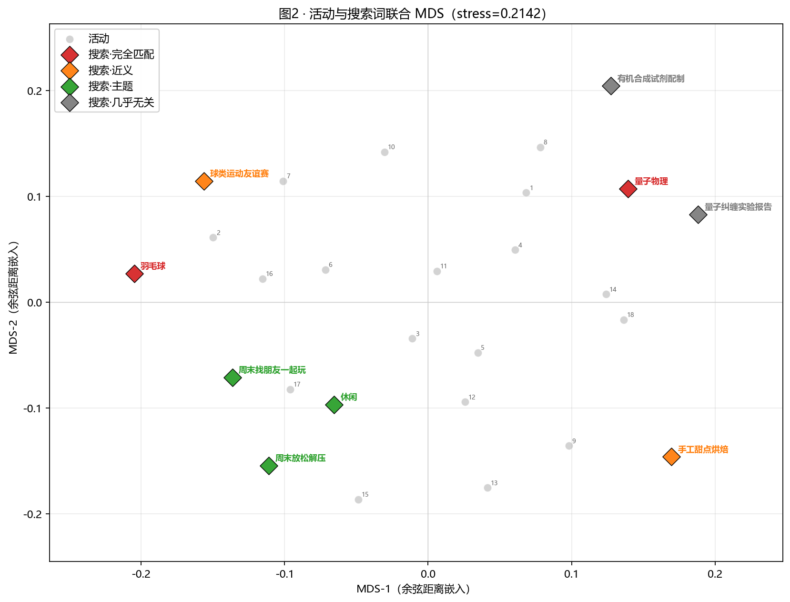
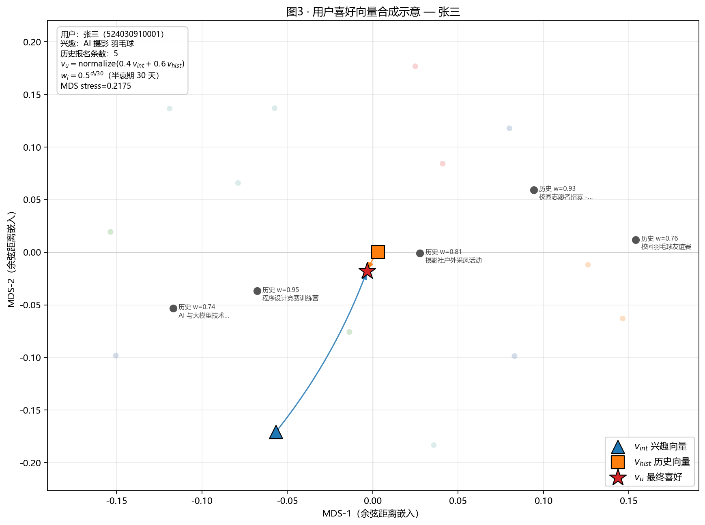
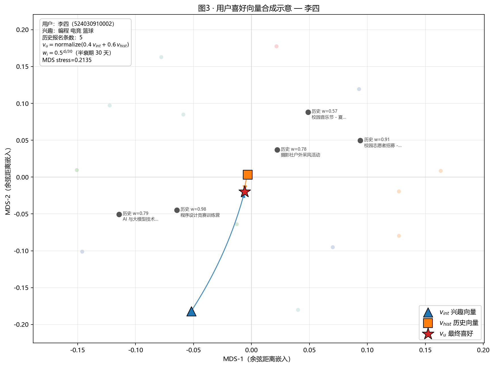
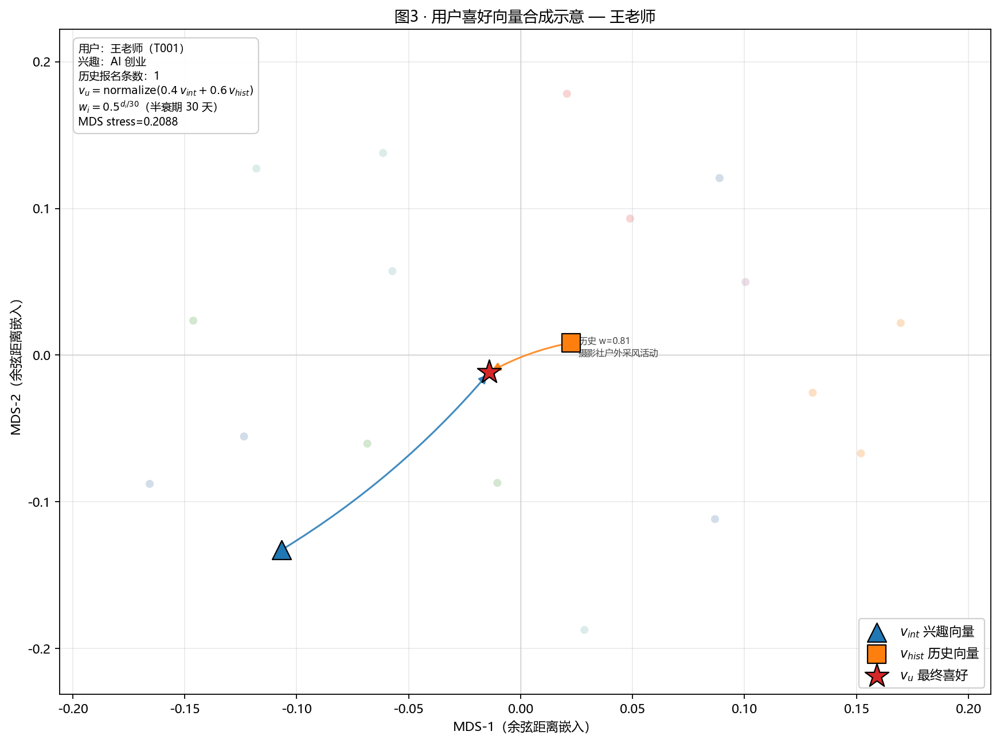
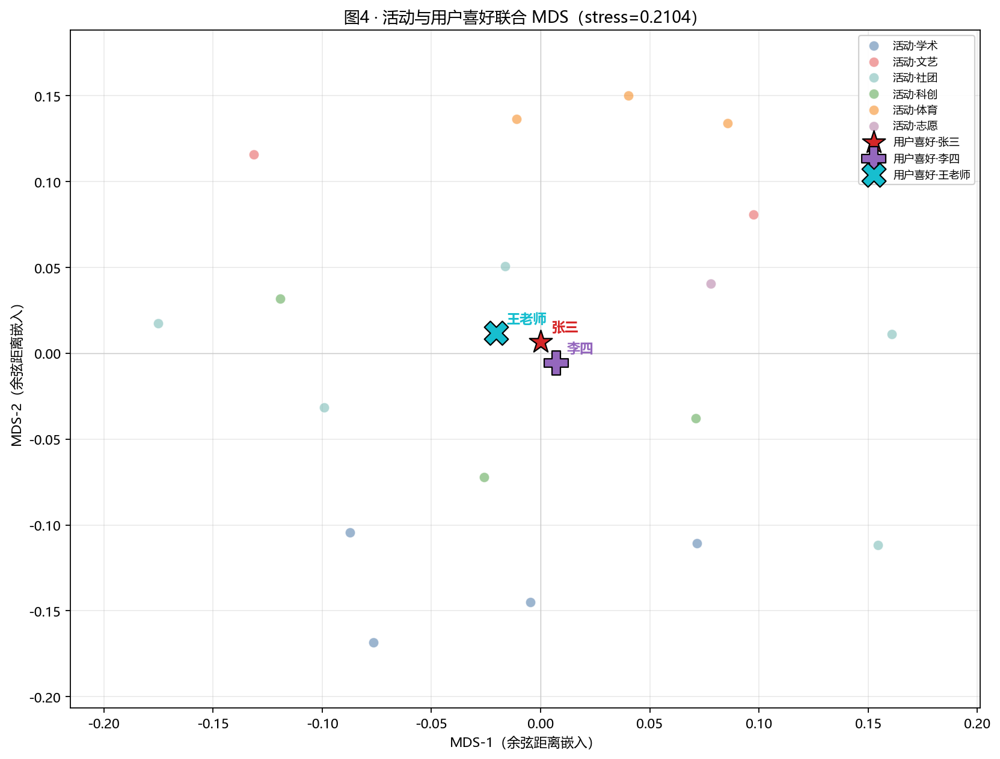

# 活动 / 用户 Embedding 的 Metric MDS 二维可视化报告

## 1. 实验目标

将活动稠密向量、搜索词向量与用户喜好向量投影到二维平面，使**图中欧氏距离尽量逼近高维余弦语义距离**，便于项目展示与答辩讲解。相对 PCA（前两维仅解释约 26% 方差），本报告采用 **Metric MDS**。

## 2. 实验环境与方案

- 索引：`campus_activities`，有效活动 embedding 数 **18**
- 嵌入模型：`campus_gte`（thenlper/gte-small-zh，512-d，cosine）
- 降维：**Metric MDS**，预计算距离 $d_{ij}=1-\cos(v_i,v_j)$
- 联合构图：每张图对其中全部点建同一距离矩阵后一次嵌入，保证同图内点距可比
- 喜好公式：与线上一致，见 [`检索与推荐算法流程.md`](../检索与推荐算法流程.md) §六
  - 历史加权 $w_i=0.5^{d_i/30}$；凸组合 $v_u=\mathrm{normalize}(0.4\,v_{int}+0.6\,v_{hist})$
- MDS Stress-1（$\sqrt{\sum(d'_{ij}-d_{ij})^2/\sum d_{ij}^2}$，越小越好）：
  - 图1: **0.2083**
  - 图2: **0.2142**
  - 图3-张三: **0.2175**
  - 图3-李四: **0.2135**
  - 图3-王老师: **0.2088**
  - 图4: **0.2104**
- 复现：
  ```powershell
  pip install numpy matplotlib scikit-learn
  python backend/scripts/embedding-mds-visualize.py
  ```
- 绘图中文字体：`Microsoft YaHei`

## 3. 方法说明

1. L2 归一化全部向量（与线上 cosine / `VectorMath.normalize` 一致）。
2. 距离矩阵 $D_{ij}=1-\cos(v_i,v_j)$（对角线为 0）。
3. `sklearn.manifold.MDS(metric=True, dissimilarity="precomputed")` 优化二维坐标，使 $\|x_i-x_j\|_2 \approx D_{ij}$；报告中的 stress 为 Kruskal Stress-1。
4. **为何不用 PCA**：GTE 语义散布在高维，前两主成分累计方差约 26%，平面点距不可代表语义远近；MDS 直接保距，更适合「距离 ≈ 相关性」的展示目标。
5. 二维仍有压缩；stress 反映保距误差。正式检索仍以 ES kNN 为准。

## 4. 图1 · 全部活动分布



仅对 18 个活动联合 MDS（stress=0.2083）。类别着色。若同类点相对靠近，说明余弦语义空间中存在可观察的簇（例如体育活动彼此更近）。

## 5. 图2 · 活动 + 搜索词



活动与阈值实验搜索词联合 MDS（stress=0.2142）。搜索词与 [`cosine-threshold-experiment.md`](cosine-threshold-experiment.md) 一致：

| 标签 | query | 类型 |
| --- | --- | --- |
| exact_羽毛球 | `羽毛球` | exact |
| exact_量子物理 | `量子物理` | exact |
| synonym_球类运动 | `球类运动友谊赛` | synonym |
| synonym_手工甜点 | `手工甜点烘焙` | synonym |
| theme_周末放松 | `周末放松解压` | theme |
| theme_找伙伴玩 | `周末找朋友一起玩` | theme |
| theme_休闲 | `休闲` | theme |
| unrelated_量子纠缠 | `量子纠缠实验报告` | unrelated |
| unrelated_有机合成 | `有机合成试剂配制` | unrelated |

灰色圆点为活动，菱形为搜索词。期望：「羽毛球」「球类运动友谊赛」靠近体育活动；「量子物理」靠近学术活动；主题类靠近休闲/社团；无关查询偏离主活动云或落在别的主题邻域。图中点距可读作近似语义距离。

## 6. 图3 · 用户喜好向量计算示意

对每个种子用户：活动 ∪ $v_{int}$ ∪ $v_{hist}$ ∪ $v_u$ 联合 MDS。深色圆点为近期报名（权重标注）；三角/方块/星号分别为兴趣、历史、最终喜好；箭头表示凸组合方向。

### 张三（`524030910001`）



- 兴趣文本：`AI 摄影 羽毛球`
- 参与合成的历史报名：5 条
- 本图 MDS stress：0.2175

| 活动 | 天数 $d$ | 权重 $w$ |
| --- | ---: | ---: |
| 程序设计竞赛训练营 (id=4) | 2 | 0.955 |
| 校园志愿者招募 — 社区服务日 (id=5) | 3 | 0.933 |
| 摄影社户外采风活动 (id=3) | 9 | 0.812 |
| 校园羽毛球友谊赛 (id=2) | 12 | 0.758 |
| AI 与大模型技术前沿讲座 (id=1) | 13 | 0.741 |

### 李四（`524030910002`）



- 兴趣文本：`编程 电竞 篮球`
- 参与合成的历史报名：5 条
- 本图 MDS stress：0.2135

| 活动 | 天数 $d$ | 权重 $w$ |
| --- | ---: | ---: |
| 程序设计竞赛训练营 (id=4) | 1 | 0.977 |
| 校园志愿者招募 — 社区服务日 (id=5) | 4 | 0.912 |
| AI 与大模型技术前沿讲座 (id=1) | 10 | 0.794 |
| 摄影社户外采风活动 (id=3) | 11 | 0.776 |
| 校园音乐节 — 夏日之声 (id=6) | 24 | 0.574 |

### 王老师（`T001`）



- 兴趣文本：`AI 创业`
- 参与合成的历史报名：1 条
- 本图 MDS stress：0.2088

| 活动 | 天数 $d$ | 权重 $w$ |
| --- | ---: | ---: |
| 摄影社户外采风活动 (id=3) | 9 | 0.812 |

合成后的 $v_u$ 在语义距离意义下应落在 $v_{int}$ 与 $v_{hist}$ 之间偏历史一侧（权重 0.6），与 `UserPreferenceVectorService` 一致。

## 7. 图4 · 活动 + 用户喜好



活动与三位用户最终 $v_u$ 联合 MDS（stress=0.2104）。喜好落点邻近的活动类别，应与兴趣标签及近期报名主题大体一致——这正是首页推荐 kNN 所依据的语义邻域。

## 8. 结论与局限

1. **Metric MDS + 余弦距离** 使图上点距可近似解读为语义远近，优于 PCA 展示。
2. 搜索词相对活动的落点可与阈值实验排序趋势相互印证。
3. 图3 可直接用于讲解喜好向量流水线（兴趣 ⊕ 时间衰减历史）。
4. **局限**：二维压缩仍有误差（见 stress）；seed 规模小；正式排序以 ES kNN / 推荐打分为准。
